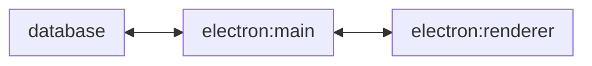
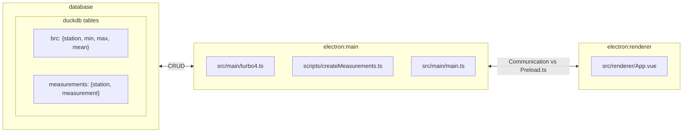
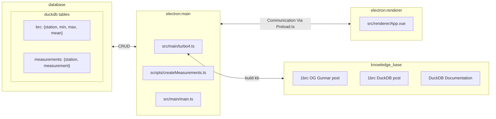

# 1 Billion Row Challenge with Electron, DuckDB, Prompts, Cursor and Aider
> Progressing our Agentic engineering abilities by building a 1 billion row challenge app with Electron, DuckDB, Prompts, Cursor and Aider

qqq add thumbnail here

## Setup
- `brew install duckdb` (mac see [docs for other platforms](https://duckdb.org/docs/installation/?version=latest&environment=cli&installer=binary&platform=win))
- `yarn install`
- `cp .env.sample .env` - Update the .env file with your openai key
- `yarn run generate <number of rows>` - Generate the data (optional)
  - *'I wrote the generation script (scripts/createMeasurements.ts) based off the original implementation, to be memory efficient for node, but it still takes a while to generate the data since node is (relatively) hella slow.'*
  - *'On my M2 64gb ram 1 billion rows took ~8 minutes to generate'. Adjust accordingly.*
  - *'I recommend generating 1mil rows'*
  - *'The committed `data/measurements.txt` is 1 million rows'*
- `duckdb ./data/db.duckdb < ./data/agentOutput/generate-table.sql` - Create the tables based on `data/measurements.txt` (optional)
- `yarn run dev` - Start the app

### Resources
- [1 Billion Row Challenge Original](https://www.morling.dev/blog/one-billion-row-challenge/)
- [1 Billion Row Challenge DuckDB](https://rmoff.net/2024/01/03/1%EF%B8%8F%E2%83%A3%EF%B8%8F-1brc-in-sql-with-duckdb/)
- [DuckDB Docs](https://duckdb.org/)
- [Aider](https://aider.chat/)
- [Cursor](https://cursor.sh/)
- [Electron Vite Vue Typescript Starter](https://github.com/Deluze/electron-vue-template)
- [Vuetify Server Table](https://vuetifyjs.com/en/components/data-tables/server-side-tables/#examples)
- [Vuetify Pagination](https://vuetifyjs.com/en/components/paginations/#disabled)
- [Electron](https://www.electronjs.org/)
- [LLM In CLI](https://github.com/simonw/llm)

## Primary DuckDB Generation Commands
- Prove our agents did their jobs
  - `duckdb ./data/db.duckdb < ./data/agentOutput/generate-table.sql`
  - `duckdb ./data/db.duckdb .tables`
  - `duckdb ./data/db.duckdb from measurements limit 5`
  - `duckdb ./data/db.duckdb from brc limit 5`
- Run page table script
  - `bun ./data/agentOutput/pageTable.ts`
  - 
## DuckDB Commands
- `duckdb` - Start DuckDB Shell
- In the shell
  - `.open <database>` - Open a database
  - `.tables` - List all tables
  - `.schema <table>` - Show schema of a table
  - `.quit` - Quit the shell
  - `.help` - Show help
- `duckdb <path/to/database.duckdb>` - Start Shell with database
- `duckdb <path/to/database.duckdb> <sql statement>` - Run SQL statement on database
- `duckdb <path/to/database.duckdb> <duckdb command>` - Run DuckDb statement on database

## Generate the Data
- `yarn run generate <number of rows>`

## Checkout the video where we built this
- [Youtube](https://youtu.be/E6bcyo32zss)

## Arch Diagrams

### Tier 1 Detail

### Tier 2 Detail

### Tier 3 Knowledgebase
